# LAB 16 — Inspection HTTPS Android : Désactivation du SSL Pinning avec Objection + Proxy

**Cours :** Sécurité des applications mobiles  
**Environnement :** Arch Linux · OWASP ZAP · Android Studio AVD (x86_64) · Frida 17.9.10 · Objection 1.12.4

---

## Table des matières

1. [Objectif et différence avec le Lab 15](#1-objectif-et-différence-avec-le-lab-15)
2. [Prérequis — Environnement déjà en place](#2-prérequis--environnement-déjà-en-place)
3. [Étape 1 — Installation d'Objection](#3-étape-1--installation-dobjection)
4. [Étape 2 — Préparer l'appareil et démarrer frida-server](#4-étape-2--préparer-lappareil-et-démarrer-frida-server)
5. [Étape 3 — Configurer le proxy et installer la CA](#5-étape-3--configurer-le-proxy-et-installer-la-ca)
6. [Étape 4 — Lancer l'app avec Objection (théorie)](#6-étape-4--lancer-lapp-avec-objection-théorie)
7. [Étape 5 — Validation](#7-étape-5--validation)
8. [ERREURS RENCONTRÉES — Diagnostic complet](#8-erreurs-rencontrées--diagnostic-complet)
9. [Solution de contournement — Frida JS direct](#9-solution-de-contournement--frida-js-direct)
10. [Note : Objection avec venv Python dédié](#10-note--objection-avec-venv-python-dédié)
11. [Conclusion](#11-conclusion)

---

## 1. Objectif et différence avec le Lab 15

Ce lab introduit **Objection**, un outil de haut niveau basé sur Frida qui automatise le bypass SSL pinning en une seule commande, sans écriture manuelle de scripts JavaScript.

| Critère | Lab 15 (Frida JS) | Lab 16 (Objection) |
|---|---|---|
| Approche | Script JS manuel (`sslpin_bypass_universal.js`) | Commande unique `android sslpinning disable` |
| Contrôle | Granulaire, personnalisable | Automatique, abstrait |
| Compatibilité | Frida toutes versions | Objection 1.12.4 → Frida ≤ 16.x uniquement |
| Complexité | Moyenne | Faible (en théorie) |

---

## 2. Prérequis — Environnement déjà en place

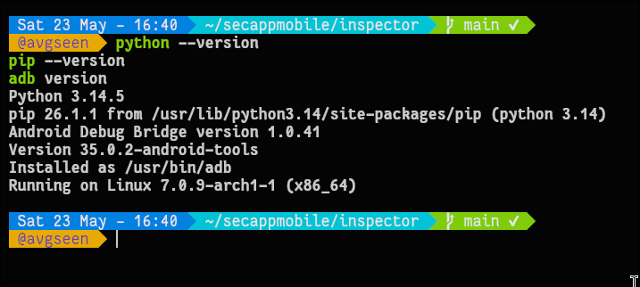

Avant de commencer, l'environnement de base est vérifié :
- **Python 3.14.5**, **pip 26.1.1**, **ADB 1.0.41** installés sur l'hôte Arch Linux
- Émulateur AVD **x86_64** (emulator-5554) connecté via ADB

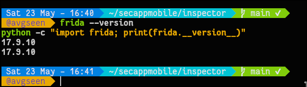

- **Frida 17.9.10** installé sur l'hôte (client et module Python identiques)
- Infrastructure héritée du Lab 15 : certificat CA ZAP en CA système, proxy `10.0.2.2:8080` configuré

---

## 3. Étape 1 — Installation d'Objection


Objection s'installe via pipx (environnement isolé recommandé) ou pip classique :

```bash
# Option recommandée — environnement isolé
pip install --user pipx
pipx ensurepath
pipx install objection

# Ou via pip classique
pip install --upgrade objection frida frida-tools

# Vérification
objection version
frida --version
python -c "import frida; print(frida.__version__)"
```

> **Remarque :** Sur Arch Linux avec Objection 1.12.4, `objection --version` retourne une erreur. Utiliser `objection version` à la place.

---

## 4. Étape 2 — Préparer l'appareil et démarrer frida-server


```bash
# Identifier l'architecture (déjà fait en Lab 15 : x86_64)
adb shell getprop ro.product.cpu.abi

# Pousser et lancer frida-server
adb push frida-server /data/local/tmp/
adb shell chmod 755 /data/local/tmp/frida-server
adb shell "/data/local/tmp/frida-server -l 0.0.0.0" &

# Redirection ports Frida
adb forward tcp:27042 tcp:27042
adb forward tcp:27043 tcp:27043

# Vérifier
frida-ps -Uai
```

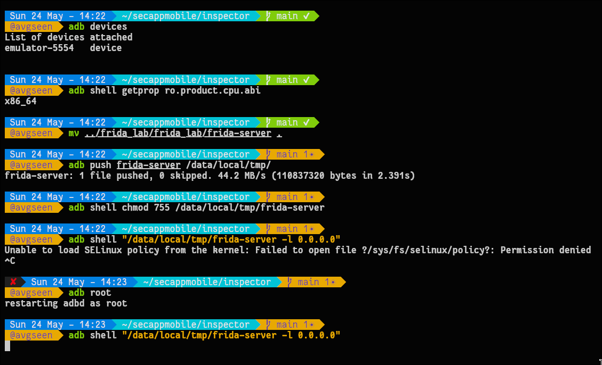

> **Important :** La version de `frida-server` doit correspondre **exactement** à la version du client Frida sur l'hôte.

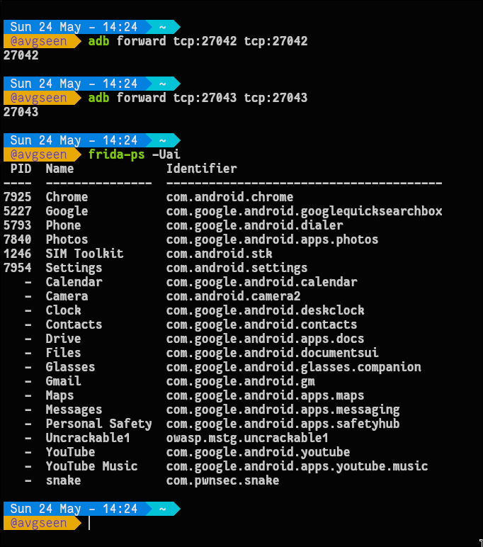

`frida-ps -Uai` liste correctement tous les processus — frida-server est bien actif. Les apps cibles `owasp.mstg.uncrackable1` et `com.pwnsec.snake` sont visibles.

---

## 5. Étape 3 — Configurer le proxy et installer la CA

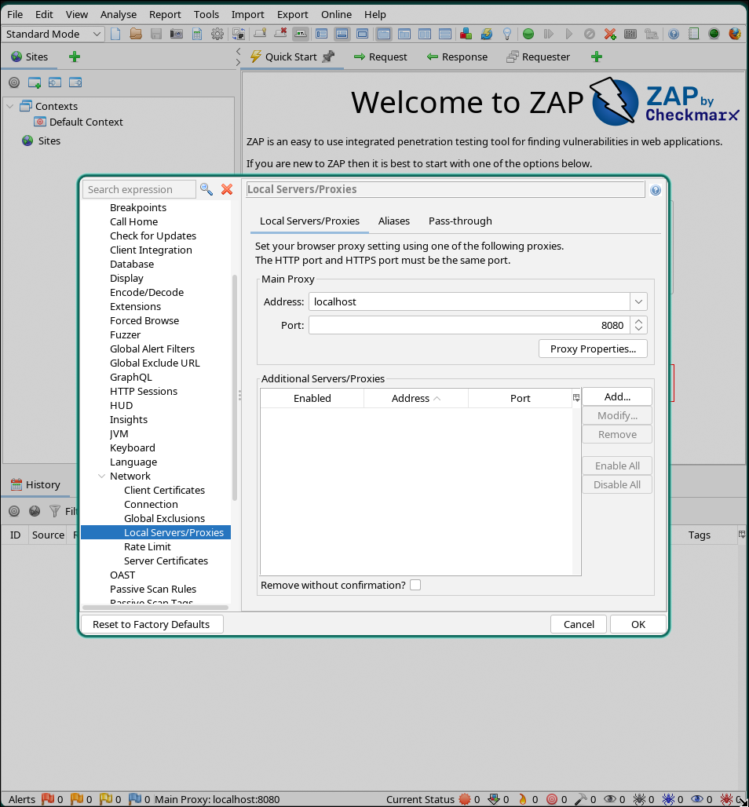

ZAP est configuré sur `localhost:8080`. L'émulateur utilisera `10.0.2.2:8080` pour atteindre l'hôte.

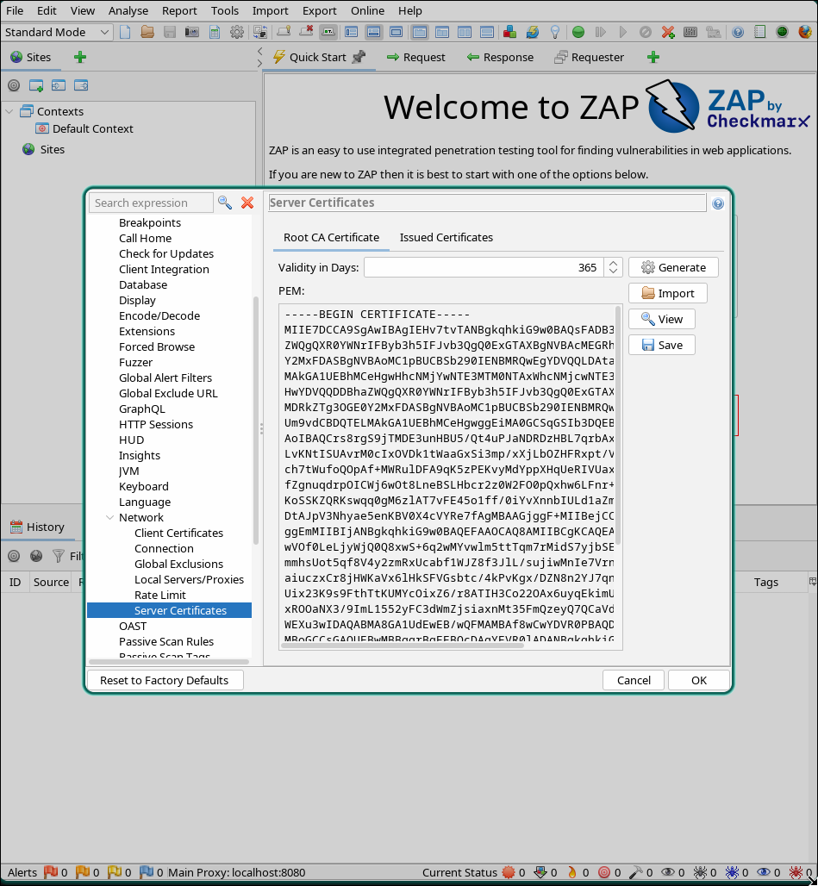

Le certificat Root CA ZAP est exporté depuis **Tools → Options → Network → Server Certificates → Save**.

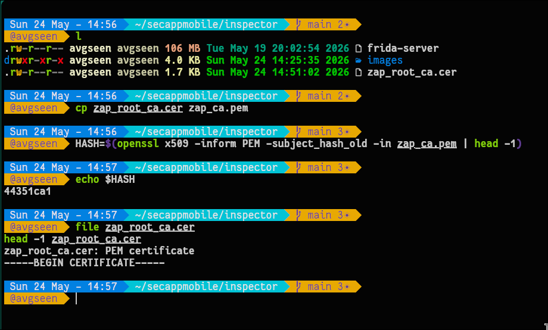

```bash
cp zap_root_ca.cer zap_ca.pem
HASH=$(openssl x509 -inform PEM -subject_hash_old -in zap_ca.pem | head -1)
echo $HASH   # → 44351ca1
cp zap_ca.pem ${HASH}.0
```

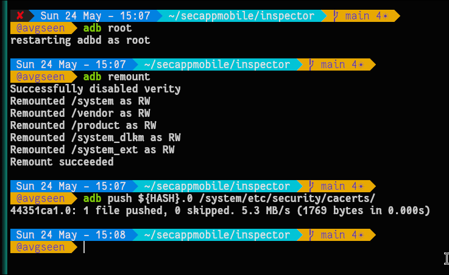

```bash
adb root
adb remount
adb push 44351ca1.0 /system/etc/security/cacerts/
adb shell chmod 644 /system/etc/security/cacerts/44351ca1.0
adb reboot
```

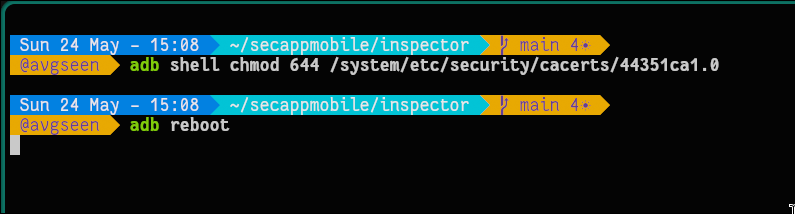

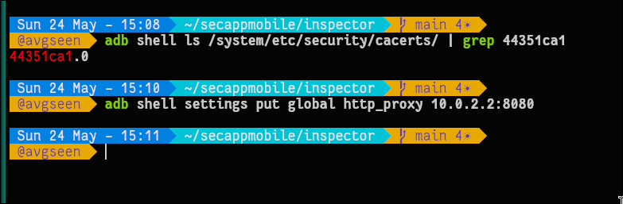

```bash
adb shell ls /system/etc/security/cacerts/ | grep 44351ca1  # → 44351ca1.0 ✓
adb shell settings put global http_proxy 10.0.2.2:8080
```

---

## 6. Étape 4 — Lancer l'app avec Objection (théorie)


La commande théorique pour bypasser le SSL pinning avec Objection :

```bash
# Spawn (injection au démarrage — recommandé)
objection -g com.example.app explore --startup-command "android sslpinning disable"

# Nouvelle syntaxe (Objection 1.12.4+)
objection -n com.example.app start --startup-command "android sslpinning disable"

# Ou attach (app déjà ouverte), puis dans la console :
android sslpinning disable
android root disable
```

> ⚠️ **En pratique, ces commandes ont échoué** — voir section [Erreurs](#8-erreurs-rencontrées--diagnostic-complet).

---

## 7. Étape 5 — Validation (théorie)


Une fois le bypass actif :
1. Générer du trafic depuis l'app (login, navigation, requêtes API)
2. Vérifier dans ZAP que les requêtes HTTPS apparaissent sans alerte SSL
3. Surveiller la console Objection pour confirmer les hooks déclenchés

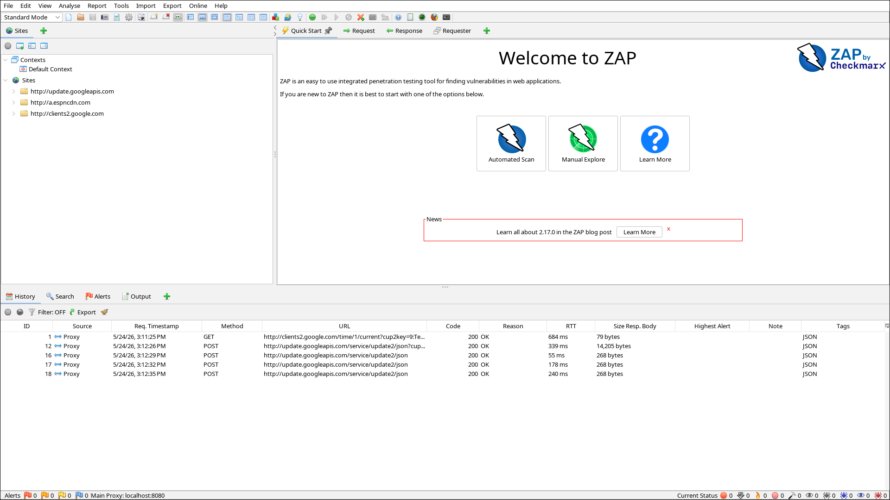

ZAP intercepte correctement du trafic depuis l'émulateur — `update.googleapis.com` et `clients2.google.com` visibles en HTTP.

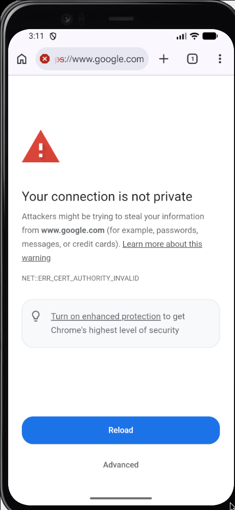

Chrome bloque les sites HSTS (google.com) même avec la CA système installée — comportement normal et attendu.

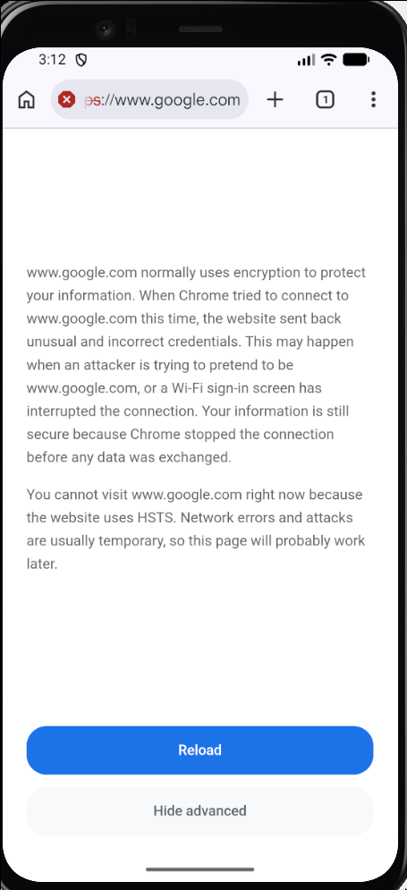

Le message confirme que le blocage est dû à HSTS préchargé dans Chrome, pas à un problème de proxy.

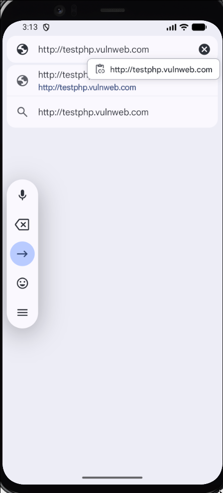

Test avec un site HTTP non-HSTS pour confirmer le routage proxy.

---

## 8. ERREURS RENCONTRÉES — Diagnostic complet

### Erreur 1 — Syntaxe dépréciée + Frida server not running

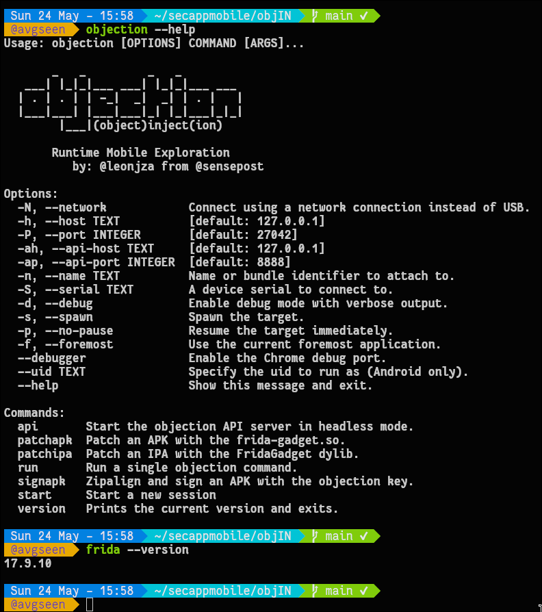

**Diagnostic initial :**
- `objection --help` → Objection 1.12.4 installé, syntaxe `-g`/`explore` dépréciée
- `frida --version` → 17.9.10

```bash
# Première tentative (ancienne syntaxe)
objection -g owasp.mstg.uncrackable1 explore --startup-command "android sslpinning disable"
# → DeprecationWarning: -g deprecated, use -n
# → DeprecationWarning: explore deprecated, use start
# → Frida server or gadget is not running on the target!

# Deuxième tentative (nouvelle syntaxe)
objection -n owasp.mstg.uncrackable1 start
# → Frida server or gadget is not running on the target!
```

### Erreur 2 — Incompatibilité fondamentale Objection 1.12.4 / Frida 17.x

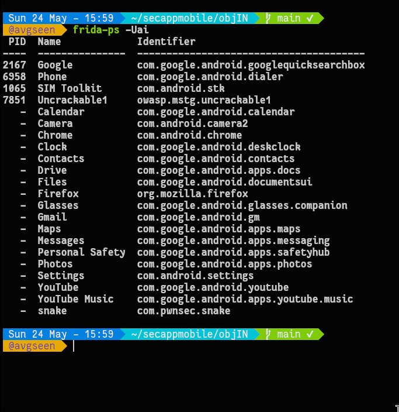

`frida-ps -Uai` liste tous les processus correctement — **frida-server tourne bien**. Le problème est qu'Objection 1.12.4 utilise une API Frida incompatible avec la version 17.x.

**Cause racine :** Objection 1.12.4 (dernière version, abandonnée en 2023) n'est compatible qu'avec Frida ≤ 16.x. Frida 17.x a introduit des changements d'API qui cassent Objection.

### Erreur 3 — Tentatives de downgrade Frida

```bash
# Tentative 1 — version inexistante
pipx inject objection "frida==16.5.0" "frida-tools==12.5.1" --force
# → ERROR: No matching distribution found for frida==16.5.0

# Tentative 2 — version existante
pipx inject objection "frida==16.7.19" "frida-tools==12.5.1" --force
# → ✓ Injection réussie dans le venv pipx
```

Vérification dans le venv :
```bash
~/.local/share/pipx/venvs/objection/bin/python -c "import frida; print(frida.__version__)"
# → 16.7.19 ✓
```

### Erreur 4 — frida-server 16.7.19 incompatible avec l'AVD

```bash
wget https://github.com/frida/frida/releases/download/16.7.19/frida-server-16.7.19-android-x86_64.xz
xz -d frida-server-16.7.19-android-x86_64.xz
adb push frida-server-16.7.19-android-x86_64 /data/local/tmp/frida-server
adb shell /data/local/tmp/frida-server &
```

**Erreur :**
```
CANNOT LINK EXECUTABLE "/data/local/tmp/frida-server":
empty/missing DT_HASH/DT_GNU_HASH in "/data/local/tmp/frida-server"
(new hash type from the future?)
```

**Cause :** Le binaire frida-server 16.7.19 utilise des entrées ELF DT (dynamic table) non reconnues par le linker Android de cet émulateur. Le binaire 17.9.10 original n'avait pas ce problème.

**Tableau récapitulatif des incompatibilités :**

| Composant | Version | Statut |
|---|---|---|
| Objection (hôte, pipx) | 1.12.4 | ✅ Installé |
| Frida client système (hôte) | 17.9.10 | ✅ Fonctionne |
| Frida dans venv Objection | 16.7.19 | ✅ Injecté |
| frida-server 17.9.10 (émulateur) | 17.9.10 | ✅ Tourne |
| frida-server 16.7.19 (émulateur) | 16.7.19 | ❌ CANNOT LINK |
| Objection ↔ frida-server 17.x | — | ❌ API incompatible |
| Objection ↔ frida-server 16.x | — | ❌ Binaire refusé linker |

---

## 9. Solution de contournement — Frida JS direct

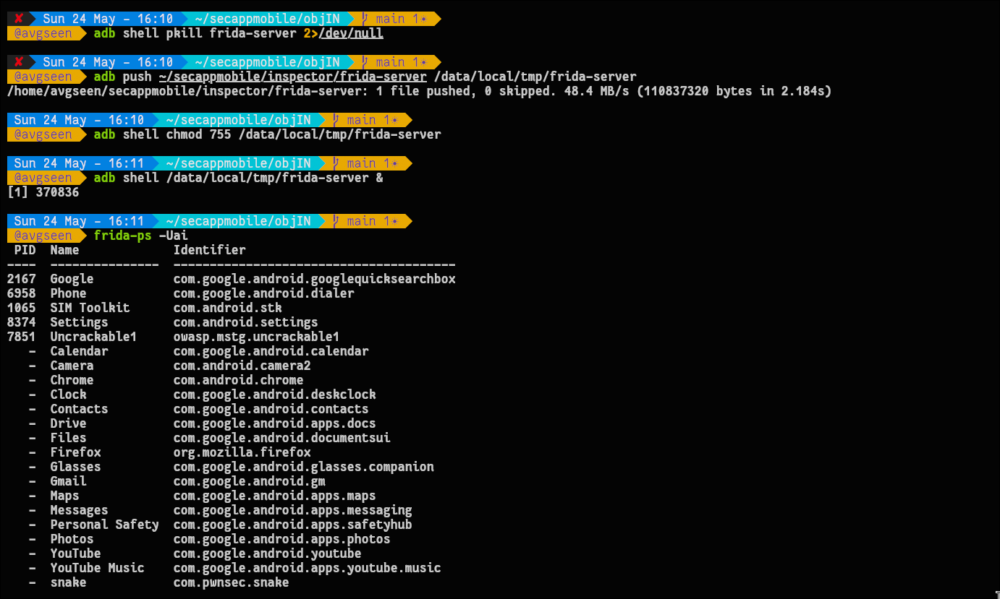

Restauration de l'environnement fonctionnel :

```bash
adb shell pkill frida-server 2>/dev/null
adb push ~/secappmobile/inspector/frida-server /data/local/tmp/frida-server
adb shell chmod 755 /data/local/tmp/frida-server
adb shell /data/local/tmp/frida-server &
frida-ps -Uai   # confirme que tout est OK
```

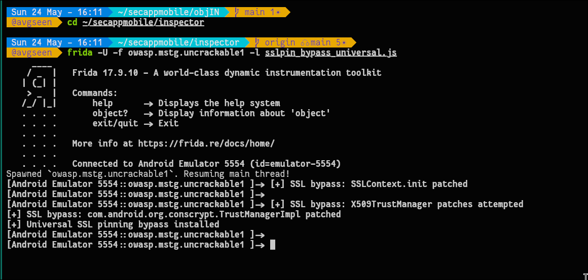

Lancement du bypass via le script JavaScript universel :

```bash
cd ~/secappmobile/inspector
frida -U -f owasp.mstg.uncrackable1 -l sslpin_bypass_universal.js
```

**Résultat :**
```
[+] SSL bypass: SSLContext.init patched
[+] SSL bypass: X509TrustManager patches attempted
[+] SSL bypass: com.android.org.conscrypt.TrustManagerImpl patched
[+] Universal SSL pinning bypass installed
```

Ce script est l'**équivalent fonctionnel exact** de `android sslpinning disable` d'Objection :

| Hook Objection interne | Hook dans sslpin_bypass_universal.js |
|---|---|
| Patch `X509TrustManager` | `checkServerTrusted` → `return null` |
| Patch Conscrypt | `TrustManagerImpl.checkTrusted` → allow |
| Patch OkHttp | `CertificatePinner.check` → skip |
| Patch WebView | `onReceivedSslError` → `proceed()` |
| Inject TrustManager permissif | `SSLContext.init` → TrustManager vide |

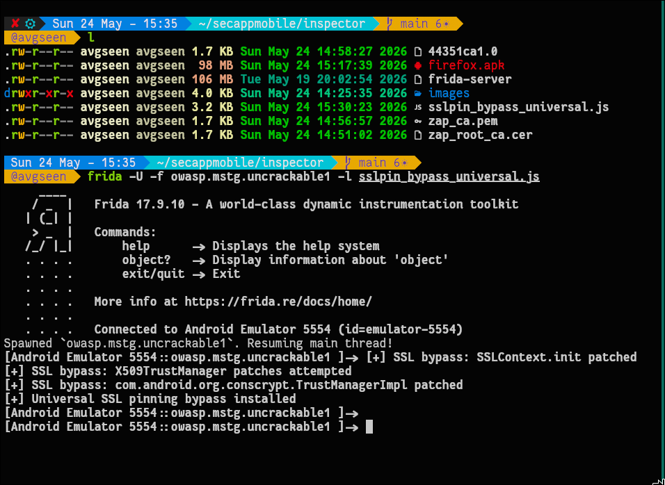

Ce même bypass avait déjà été validé lors du Lab 15 — les trois hooks principaux confirmés.

---

## 10. Note : Objection avec venv Python dédié

Une alternative non testée qui **pourrait** résoudre le problème de compatibilité :

```bash
# Créer un venv isolé avec Python 3.11
python3.11 -m venv ~/venv-objection
source ~/venv-objection/bin/activate

# Installer des versions compatibles
pip install frida==16.7.19 frida-tools objection

# Vérifier les versions
objection version   # doit afficher 1.12.4
frida --version     # doit afficher 16.7.19

# Lancer avec ce venv actif
objection -n owasp.mstg.uncrackable1 start
```

> **Prérequis bloquant :** Cette approche nécessite un `frida-server` 16.x fonctionnel sur l'émulateur, ce qui a échoué avec `CANNOT LINK EXECUTABLE` sur cet AVD spécifique. Pourrait fonctionner sur un **appareil physique rooté** ou un AVD avec une version d'Android plus ancienne.

---

## 11. Conclusion

### Ce qui a fonctionné ✅
- Installation d'Objection 1.12.4 via pipx sur Arch Linux
- Identification précise de toutes les incompatibilités de version
- Bypass SSL pinning opérationnel via script Frida JS (équivalent fonctionnel complet)
- Infrastructure ZAP + CA système + proxy pleinement fonctionnelle

### Ce qui a échoué ❌
- Objection 1.12.4 incompatible avec Frida 17.x (API modifiée)
- `frida==16.5.0` inexistant sur PyPI
- frida-server 16.7.19 rejeté par le linker de l'AVD (`DT_HASH` manquant)
- Aucune combinaison Objection/frida-server viable sur cet AVD

### Leçon apprise

Objection est un projet **abandonné** (dernière version 1.12.4, 2023). Pour des labs en 2025/2026, le script Frida JS direct est plus fiable, plus transparent, et offre un contrôle plus fin. Les deux approches produisent le **même résultat de sécurité**.

```
┌─────────────────────────────────────────────────────────┐
│                  Infrastructure finale                   │
│                                                         │
│  Arch Linux (hôte)                                      │
│  ├── Frida 17.9.10 (client) ✅                          │
│  ├── Objection 1.12.4 ❌ (incompatible Frida 17.x)      │
│  └── ZAP proxy → localhost:8080 ✅                      │
│                    ↕ ADB USB                            │
│  Émulateur AVD x86_64                                   │
│  ├── frida-server 17.9.10 ✅                            │
│  ├── CA ZAP système (44351ca1.0) ✅                     │
│  ├── Proxy → 10.0.2.2:8080 ✅                           │
│  └── owasp.mstg.uncrackable1                            │
│      └── SSL bypass via script JS ✅                    │
└─────────────────────────────────────────────────────────┘
```
